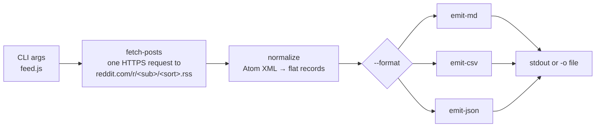

# subreddit-feed

Point this at any subreddit and get clean Markdown, CSV or JSON — one command, no API keys.

```
node feed.js r/automation --format csv
```

I built this as a small, honest demo of how I ship data tools: one polite request per run, predictable output in three formats, and a CI job that fails loudly instead of pretending everything is fine.

## Sample output

A real, unedited excerpt from [`samples/r-automation-hot.md`](samples/r-automation-hot.md) — this exact file is produced by the CLI and refreshed by the daily CI run; check the `/samples` commit timestamps for freshness:

```markdown
# r/automation — hot (10 posts)

| # | Title | Author | Posted (UTC) | Excerpt |
| --- | --- | --- | --- | --- |
| 1 | [AI Agents are overrated, simple automations are still king](https://www.reddit.com/r/automation/comments/1v7e3zu/ai_agents_are_overrated_simple_automations_are/) | hassanwithanh | 2026-07-26T19:50:30.000Z | Just to show you that I know what I'm talking about :) Way too many of you are trying to build AI agents for simple automations… |
```

All three formats live in [`/samples`](samples/): [Markdown](samples/r-automation-hot.md) · [CSV](samples/r-automation-hot.csv) · [JSON](samples/r-automation-hot.json).

## Quickstart

Needs Node.js 20+.

```bash
git clone https://github.com/Razeow96/subreddit-feed.git
cd subreddit-feed
npm install
node feed.js r/automation --format csv
```

Full usage:

```
node feed.js r/<subreddit> [options]

  --format md|csv|json   output format (default: md)
  --limit N              number of posts, 1-100 (default: 25)
  --sort hot|new|top     listing sort (default: hot)
  -o <file>              write to file instead of stdout
```

## How it works



- **fetch-posts** makes exactly one request per run with a descriptive User-Agent. Any failure (403, 404, 429, timeout, bad XML) exits non-zero with a clear message — it never emits partial or garbage output.
- **normalize** flattens each Atom entry to: `title`, `author`, `created_utc` (ISO 8601), `permalink`, `external_url` (link posts), `excerpt` (first 200 chars of selftext, sanitized), plus `score` / `num_comments`.
- **emit-md / emit-csv / emit-json** each render that one record shape. CSV follows RFC 4180 — commas, quotes and newlines in titles round-trip cleanly.

**Why the RSS endpoint?** Reddit's public `.json` listing endpoint returns HTTP 403 for unauthenticated clients on many networks; the `.rss` endpoint is served reliably without keys. The trade-off is honest and documented: the Atom feed does not expose vote or comment counts, so `score` and `num_comments` are `null` rather than fabricated.

The only dependency is [`fast-xml-parser`](https://www.npmjs.com/package/fast-xml-parser), for the Atom XML.

## Live proof

[](https://github.com/Razeow96/subreddit-feed/actions/workflows/daily-refresh.yml)

A [GitHub Actions cron job](.github/workflows/daily-refresh.yml) re-runs the CLI daily and commits the refreshed `/samples`. If Reddit blocks the runner's IP, the job fails visibly and commits nothing — an honest red X beats fake freshness. The commit timestamps on `/samples` are the proof of life.

## Hire me

I build small, reliable automation and data tools like this one.

- Fiverr — link pending
- Upwork — link pending
- Contra — link pending

## License

[MIT](LICENSE) © 2026 Razeow
